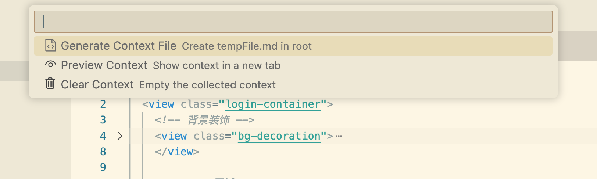

# ContextCollector for VSCode


**ContextCollector** 是一款旨在彻底改变您与AI编程助手（如ChatGPT、Copilot Chat等）协作方式的VSCode插件。它能让您像高手一样，精准、高效地收集和组织代码上下文，从而获得AI更高质量的回答。

告别在多个文件间繁琐的手动复制粘贴，专注于创造，让ContextCollector为您处理上下文准备工作！

[](https://marketplace.visualstudio.com/items?itemName=huige9999.contextcollector)
[](https://marketplace.visualstudio.com/items?itemName=huige9999.contextcollector)

---

## ✨ 核心特性 (Features)

ContextCollector 遵循“小而美”的设计哲学，提供了一套流畅、无打扰的工作流。

### 1. 🎯 精准添加代码片段

选中您需要的任何代码，右键点击选择 `ContextCollector: Add to Context`，即可将其轻松加入上下文集合。

  


### 2. 👀 实时状态与快捷操作

VSCode状态栏右下角会实时显示当前已收集的上下文状态。点击它，即可快速访问所有核心功能。

  




### 3. 📄 即时预览

在生成最终文件前，随时通过 `Preview Context` 功能在新标签页中查看已收集内容的完整样貌，确保一切尽在掌握。

  


### 4. 🚀 一键生成AI友好格式

选择 `Generate Context File`，插件会立即在您的工作区根目录创建一个 `tempFile.md`。该文件采用对大语言模型（LLM）特别优化的格式，包含清晰的文件结构和带语法高亮的代码块。

**生成的 `tempFile.md` 示例:**
```markdown
# File Structure
```
src/components/Button.vue
src/views/main.ts
```

# File Content
--- 
`src/components/Button.vue`:

```vue
<template>
  <button @click="handleClick"><slot></slot></button>
</template>
```

--- 
`src/views/main.ts`:

```typescript
import { createApp } from 'vue'
import App from './App.vue'

createApp(App).mount('#app')
```
```

### 5. 🧹 轻松清空

当一次AI会话结束后，通过 `Clear Context` 选项即可一键清空所有收集的内容，为下一次任务做准备。

---

## 🚀 如何使用 (Usage)

1.  **安装插件**: 在VSCode扩展市场搜索 `ContextCollector` 并安装。
2.  **收集代码**: 在代码编辑器中，选中你想要提供给AI的代码片段。
3.  **添加至上下文**: 右键点击，选择 `ContextCollector: Add to Context`。
4.  **管理上下文**:
    *   观察VSCode右下角的状态栏，那里会显示已收集的文件数量。
    *   点击状态栏项 `$(clippy) Context: X files`。
    *   在弹出的菜单中选择 `Preview Context`、`Generate Context File` 或 `Clear Context`。
5.  **与AI协作**: 打开生成的 `tempFile.md`，复制其全部内容，粘贴给你的AI助手。

---

## 🛠️ 插件设置 (Extension Settings)

本插件目前无需额外配置，开箱即用！

---

## 🐛 已知问题 (Known Issues)

目前没有已知的重大问题。如果您发现任何bug，欢迎通过我们的 [GitHub Issues](https://github.com/huige9999/ContextCollector/issues) 页面提交反馈。

---

## 📝 更新日志 (Release Notes)

### 1.0.0

*   🎉 **初始版本发布!**
*   添加代码到上下文集合。
*   通过状态栏和快捷菜单进行预览、生成文件和清空操作。
*   生成的Markdown文件包含文件结构和内容。

*(未来版本的更新日志将在此处续写)*

---

**享受与AI更高效的协作吧！**

如果您喜欢这款插件，请考虑在 [Marketplace](https://marketplace.visualstudio.com/items?itemName=huige9999.contextcollector) 上给它一个 ⭐ 好评，或者在 [GitHub](https://github.com/huige9999/ContextCollector) 上给我们点亮一个Star！

**Enjoy!**